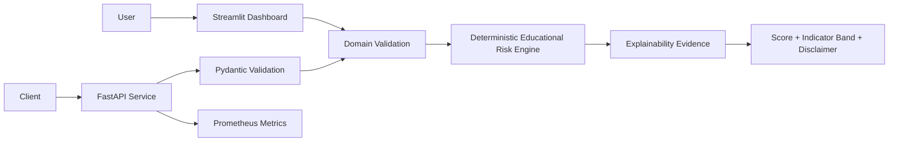
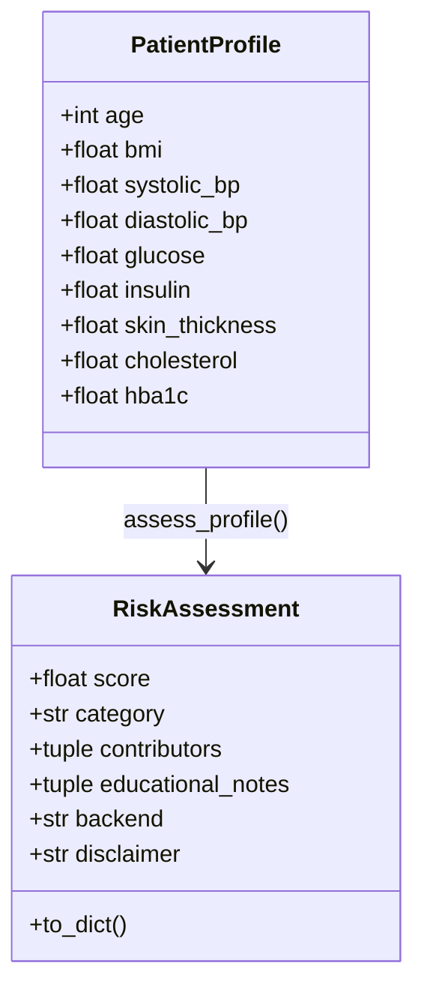
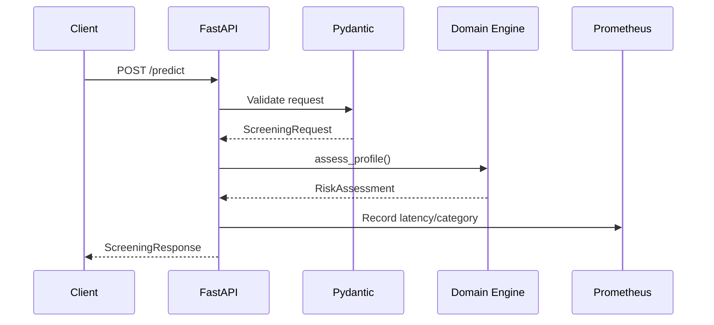

# Architecture — Disease Prediction Capstone

## Scope and Safety Boundary

Disease Prediction Capstone is an educational software-engineering portfolio project. The current deployable path is a transparent, deterministic risk-screening demonstration. It is not a medical device, does not diagnose disease, and is not validated for patient-care decisions.

## System Context



The Streamlit dashboard and FastAPI service share the same domain implementation in `src/risk_engine.py`. This avoids duplicated scoring rules and keeps the public interface behavior consistent.

## Component Responsibilities

| Component | Responsibility |
|---|---|
| `src/risk_engine.py` | Bounded input contract, deterministic scoring, examples, explanation evidence |
| `api/main.py` | HTTP contracts, Pydantic validation, metrics, API documentation |
| `streamlit_app.py` | Interactive public dashboard, responsible-use guidance, downloads, Q&A |
| `streamlit_demo/app.py` | Lightweight Streamlit Community Cloud entry point |
| `agents/state.py` | Immutable compatibility state for the supervisor workflow |
| `agents/guards.py` | Configurable demonstration latency guard |
| `agents/supervisor.py` | Deterministic orchestration and safety-review compatibility layer |
| `Dockerfile` | Minimal, multi-stage, non-root API runtime |
| `.github/workflows/ci.yml` | Quality, tests, Streamlit health, container health, release readiness |
| `.github/workflows/security.yml` | Static analysis, secret scanning, vulnerability reports, audits, SBOM |
| `.github/workflows/release.yml` | GitHub Release artifacts and GHCR publishing |

## Domain Model



### Validation Rules

The domain layer validates:

- finite numeric values;
- documented feature ranges;
- systolic pressure greater than diastolic pressure;
- reproducible examples;
- deterministic output for identical input.

The API adds:

- JSON schema validation;
- unknown-field rejection;
- explicit request and response models;
- OpenAPI documentation.

## Scoring Design

The public baseline uses visible threshold bands for glucose, HbA1c, blood pressure, BMI, cholesterol, and age. Insulin and skin-thickness values remain in the validated feature contract but are not assigned standalone weights without a trained and calibrated model.

The score is:

- deterministic;
- bounded from 0 to 100;
- explainable through contributor strings;
- categorized as `low`, `moderate`, or `elevated` for demonstration purposes;
- explicitly not a probability or diagnosis.

## API Architecture



Endpoints:

| Method | Path | Responsibility |
|---|---|---|
| GET | `/` | Identity and responsible-use metadata |
| GET | `/health` | Dependency-free liveness |
| GET | `/metrics` | Prometheus exposition |
| GET | `/examples` | Fictional profiles and results |
| POST | `/predict` | Validated educational screening |

## Streamlit Architecture

The public dashboard is artifact-independent. It does not require:

- serialized model files;
- private datasets;
- external APIs;
- API keys;
- GPUs;
- an LLM service.

The deployment uses a dedicated dependency manifest nearest the Community Cloud entry point to reduce install time, dependency conflicts, and attack surface.

## Container Architecture

```mermaid
flowchart LR
    Source[requirements-api.txt] --> Builder[Python 3.11 Builder]
    Builder --> Venv[/opt/venv]
    Venv --> Runtime[Python 3.11 Slim Runtime]
    API[api/] --> Runtime
    Domain[src/] --> Runtime
    Runtime --> NonRoot[UID 10001]
    NonRoot --> Uvicorn[Uvicorn :8000]
    Uvicorn --> Health[/health]
```

The final image excludes local datasets, model artifacts, notebooks, secrets, test output, and development tooling.

## Continuous-Delivery Architecture

```mermaid
flowchart TD
    Change[Push / Pull Request]
    Change --> Matrix[Python 3.10 and 3.11]
    Matrix --> Compile[Compile Validation]
    Compile --> Ruff[Ruff Correctness]
    Ruff --> Tests[Domain + API + Supervisor Tests]
    Tests --> Evidence[Coverage XML + JUnit]

    Change --> Streamlit[Streamlit Smoke Test]
    Streamlit --> StreamlitHealth[/_stcore/health]

    Change --> Container[Docker Build]
    Container --> APIHealth[/health]

    Evidence --> Readiness[Release Readiness]
    StreamlitHealth --> Readiness
    APIHealth --> Readiness
```

## Security and Supply-Chain Architecture

Controls include:

- CodeQL semantic source analysis;
- Gitleaks current-tree secret scanning;
- Bandit Python security reporting;
- Trivy filesystem reporting;
- Trivy container reporting;
- `pip-audit` reports for API and Streamlit manifests;
- Dependabot updates;
- CycloneDX SBOM generation;
- release-image provenance and SBOM generation.

These controls provide automated evidence. They do not establish regulatory compliance or prove that the system is vulnerability-free.

## Operational Principles

1. **Correctness before complexity** — prefer testable, deterministic behavior.
2. **Transparency before model theater** — never represent an unvalidated heuristic as a clinical model.
3. **Data minimization** — accept only required numeric fields and reject unknown API fields.
4. **Reproducibility** — pin deployment dependencies and separate runtime manifests.
5. **Defense in depth** — validate at both API and domain boundaries.
6. **Observable behavior** — expose health and metrics contracts.
7. **Safe deployment** — use non-root containers, health checks, and automated smoke tests.
8. **Explicit governance** — document responsible use, contribution requirements, release standards, and security reporting.

## Future Architecture

Potential future work may include a separately versioned trained-model adapter, model registry, calibration evidence, subgroup analysis, OpenTelemetry traces, authentication, rate limiting, Kubernetes deployment, and signed model artifacts.

Any future model path should remain separate from the transparent baseline and must document data provenance, licensing, validation, calibration, intended use, excluded use, and limitations.
