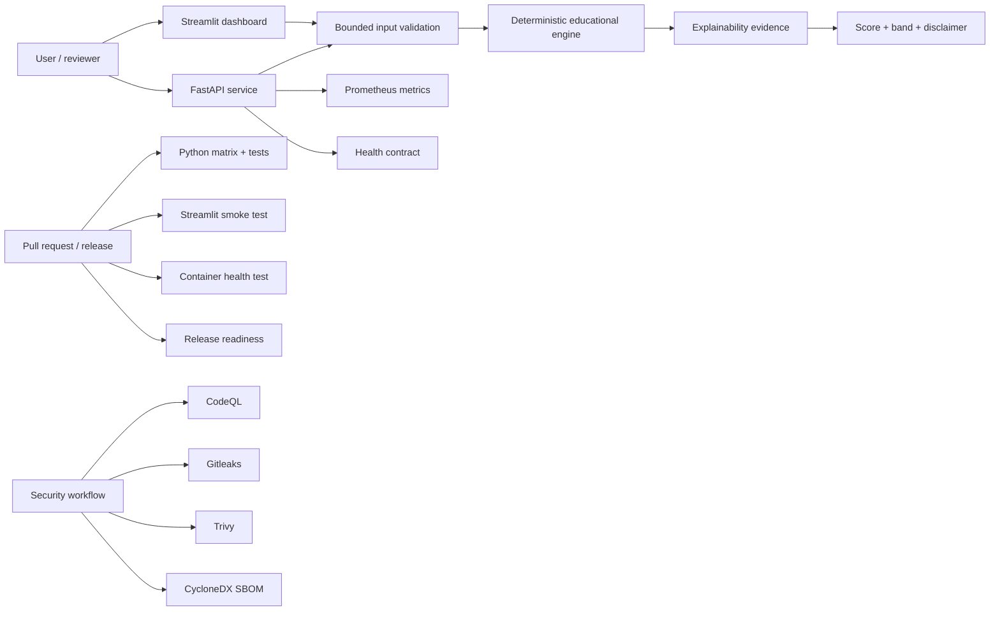
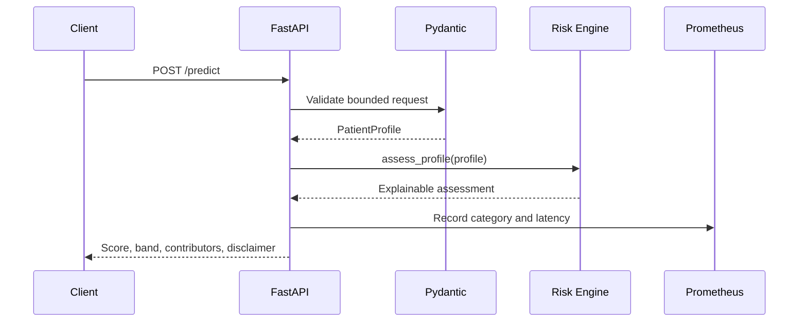
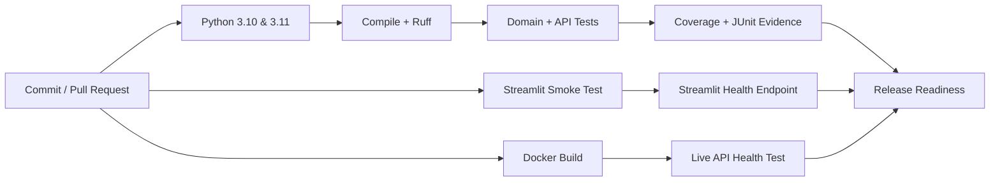

<div align="center">

# 🩺 Disease Prediction Capstone

### Production-oriented educational risk-screening platform with FastAPI, Streamlit, CI/CD, and containerized deployment.

[](https://github.com/CoreyLeath-code/Disease_Prediction_Capstone/actions/workflows/ci.yml)
[](https://github.com/CoreyLeath-code/Disease_Prediction_Capstone/actions/workflows/security.yml)
[](https://www.python.org/)
[](https://fastapi.tiangolo.com/)
[](https://streamlit.io/)
[](https://www.docker.com/)
[](LICENSE)

</div>

---

> **⚠️ Educational Demonstration**
>
> This repository demonstrates production-oriented machine learning engineering practices. It is **not** intended to diagnose disease or provide medical advice. Any healthcare deployment would require regulatory approval, representative clinical validation, fairness analysis, calibration testing, and human oversight.


Disease Prediction Capstone is a production-oriented software-engineering portfolio project that demonstrates how a health-related machine-learning interface can be designed with transparent behavior, bounded inputs, reproducible deployments, automated testing, security evidence, and explicit responsible-use controls.

The current deployable path intentionally uses a **deterministic educational risk-screening baseline** rather than presenting an unvalidated model as a clinical predictor. Every result identifies its backend, exposes the threshold contributors, includes a non-clinical disclaimer, and avoids describing the score as a calibrated disease probability.

The repository includes:

- an artifact-independent Streamlit Community Cloud dashboard;
- a validated FastAPI service;
- a shared deterministic domain engine;
- immutable supervisor-state contracts;
- explainability evidence and fictional example profiles;
- Prometheus metrics;
- multi-version CI;
- Streamlit and container health smoke tests;
- CodeQL, Gitleaks, Bandit, Trivy, `pip-audit`, Dependabot, and CycloneDX SBOM automation;
- semantic release automation and GHCR container publishing;
- complete L6 nine-tier deployment-hygiene documentation.

## Live Demo Deployment

After the upgrade is merged, deploy through Streamlit Community Cloud with:

```text
Repository:
CoreyLeath-code/Disease_Prediction_Capstone

Branch:
main

Main file path:
streamlit_demo/app.py
```

No API key, model checkpoint, private dataset, GPU, or external service is required for the built-in demonstration.

The dedicated Streamlit directory keeps the public deployment lightweight:

```text
streamlit_demo/
├── app.py
└── requirements.txt
```

See [`docs/STREAMLIT_DEPLOYMENT.md`](docs/STREAMLIT_DEPLOYMENT.md) for the complete deployment and troubleshooting runbook.

---

## What the Public Demo Does

The Streamlit application provides:

- bounded inputs for age, BMI, blood pressure, glucose, insulin, skin thickness, cholesterol, and HbA1c;
- three fictional example profiles;
- deterministic low, moderate, and elevated educational indicator bands;
- transparent score contributors;
- responsible-use and data-quality notes;
- a submitted-feature snapshot;
- downloadable JSON output;
- architecture visualization;
- nine-tier deployment-hygiene evidence;
- extended engineering Q&A.

The demo does **not**:

- diagnose disease;
- estimate a clinically calibrated probability;
- recommend medication or treatment;
- store or process real patient records by design;
- call an external LLM;
- claim regulatory approval or clinical validation.

---

## Architecture



### Request Flow



---

## Core Engineering Improvements

### Transparent Domain Engine

`src/risk_engine.py` provides:

- immutable patient-profile inputs;
- finite-value validation;
- documented feature ranges;
- blood-pressure ordering validation;
- deterministic scoring;
- explicit contributor evidence;
- reproducible fictional examples;
- JSON-serializable results;
- a mandatory responsible-use disclaimer.

The weights are intentionally simple and visible. They are not a trained or clinically calibrated model.

### Hardened FastAPI Service

`api/main.py` provides:

| Endpoint | Purpose |
|---|---|
| `GET /` | Service identity and responsible-use metadata |
| `GET /health` | Lightweight liveness contract |
| `GET /metrics` | Prometheus metrics |
| `GET /examples` | Reproducible fictional profiles and results |
| `POST /predict` | Validated educational screening result |

API controls include:

- bounded Pydantic fields;
- unknown-field rejection;
- non-finite numeric input rejection (NaN and Infinity);
- blood-pressure relationship validation;
- explicit response models;
- deterministic backend provenance;
- non-clinical disclaimer;
- request-category counters;
- error counters;
- latency histograms.

#### Input-integrity failure contract

POST /predict rejects non-finite numeric values before domain evaluation. This includes
malformed raw JSON values such as NaN and Infinity, which are returned as a JSON-safe
HTTP 422 validation response rather than an internal-server error. The regression test
covers both glucose: NaN and hba1c: Infinity.

### Supervisor Compatibility Layer

The original capstone introduced a supervisor and circuit-breaker concept. The hardened implementation preserves that public interface while correcting several issues:

- uses monotonic `time.perf_counter()` timing;
- validates circuit-breaker configuration;
- uses immutable Pydantic state snapshots;
- bounds biomarker and vital-sign values;
- rejects unknown biomarker fields;
- replaces unsupported external-LLM claims with a deterministic safety reviewer;
- replaces diagnostic language with educational indicator classifications;
- increases the default demonstration latency budget to a more realistic software-smoke-test value.

---

## Project Structure

```text
Disease_Prediction_Capstone/
├── .github/
│   ├── workflows/
│   │   ├── ci.yml
│   │   ├── security.yml
│   │   └── release.yml
│   ├── CODEOWNERS
│   ├── dependabot.yml
│   └── pull_request_template.md
├── .streamlit/
│   └── config.toml
├── agents/
│   ├── guards.py
│   ├── state.py
│   └── supervisor.py
├── api/
│   └── main.py
├── app/
│   └── main.py                 # Legacy API compatibility wrapper
├── docs/
│   ├── L6_DEPLOYMENT_HYGIENE.md
│   └── STREAMLIT_DEPLOYMENT.md
├── src/
│   └── risk_engine.py
├── streamlit_demo/
│   ├── app.py                  # Community Cloud entry point
│   └── requirements.txt
├── tests/
│   ├── test_api.py
│   └── test_risk_engine.py
├── streamlit_app.py            # Dashboard implementation
├── demo_app.py                 # Legacy Streamlit compatibility wrapper
├── requirements-api.txt
├── requirements-dev.txt
├── requirements.txt
├── Dockerfile
├── SECURITY.md
├── CONTRIBUTING.md
├── CHANGELOG.md
└── LICENSE
```

---

## Quick Start

### 1. Install

Prerequisites: Python 3.10 or 3.11, Git, and Docker for container validation.

```bash
git clone https://github.com/CoreyLeath-code/Disease_Prediction_Capstone.git
cd Disease_Prediction_Capstone
python -m venv .venv
source .venv/bin/activate  # Windows: .venv\\Scripts\\activate
python -m pip install --upgrade pip
pip install -r requirements-dev.txt
```

### 2. Launch the Streamlit dashboard

```bash
streamlit run streamlit_demo/app.py
```

Open [http://localhost:8501](http://localhost:8501). Use fictional or fully non-identifiable values only.

### 3. Launch the FastAPI service

```bash
uvicorn api.main:app --reload
```

Useful endpoints:

| URL | Purpose |
|---|---|
| [http://localhost:8000/](http://localhost:8000/) | Service identity and disclaimer |
| [http://localhost:8000/docs](http://localhost:8000/docs) | OpenAPI / Swagger UI |
| [http://localhost:8000/health](http://localhost:8000/health) | Liveness check |
| [http://localhost:8000/metrics](http://localhost:8000/metrics) | Prometheus exposition |
| [http://localhost:8000/examples](http://localhost:8000/examples) | Fictional examples |

### 4. Send a sample request

```bash
curl -X POST http://localhost:8000/predict \
  -H "Content-Type: application/json" \
  -d '{
    "age": 52,
    "bmi": 28.4,
    "systolic_bp": 134,
    "diastolic_bp": 84,
    "glucose": 112,
    "insulin": 118,
    "skin_thickness": 30,
    "cholesterol": 216,
    "hba1c": 5.9
  }'
```

The response contains a deterministic score, an educational indicator band, threshold contributors, backend provenance, and a responsible-use disclaimer. The score is not a calibrated probability.

### 5. Validate locally

```bash
python -m compileall -q api agents src tests streamlit_app.py streamlit_demo/app.py
ruff check api agents src tests streamlit_app.py streamlit_demo/app.py --select E9,F63,F7,F82
pytest tests/test_api.py tests/test_risk_engine.py tests/test_supervisor.py -v
docker build -t disease-prediction-capstone:local .
```

For deployment-specific instructions, see [the Streamlit runbook](docs/STREAMLIT_DEPLOYMENT.md), [the production deployment runbook](docs/PRODUCTION_DEPLOYMENT.md), and [the hardened Compose profile](deploy/docker-compose.production.yml).

---

## Docker Deployment

Build:

```bash
docker build -t disease-prediction-capstone .
```

Run:

```bash
docker run --rm -p 8000:8000 disease-prediction-capstone
```

Verify:

```bash
curl http://localhost:8000/health
```

The API image uses:

- a separate dependency-builder stage;
- a minimal Python 3.11 runtime;
- a non-root user with UID `10001`;
- an explicit Uvicorn entry point;
- an HTTP health check;
- no bundled datasets, notebooks, credentials, or serialized model artifacts.

---

## Testing and Quality

Run syntax validation:

```bash
python -m compileall -q api agents src tests streamlit_app.py streamlit_demo/app.py
```

Run high-confidence Ruff checks:

```bash
ruff check api agents src tests/test_api.py tests/test_risk_engine.py \
  streamlit_app.py streamlit_demo/app.py \
  --select E9,F63,F7,F82
```

Run tests with coverage:

```bash
pytest tests/test_api.py tests/test_risk_engine.py -v \
  --cov=api \
  --cov=src \
  --cov-report=term-missing \
  --cov-report=html
```

Test categories include:

- low, moderate, and elevated fictional examples;
- deterministic output;
- serialization;
- empty-threshold explanation;
- zero-value data-quality notes;
- invalid age, BMI, glucose, cholesterol, and HbA1c values;
- reversed blood-pressure values;
- root, health, metrics, examples, and prediction API contracts;
- unknown-field rejection;
- out-of-range API input rejection.

---

## Research-style Metrics and Benchmarks

This repository reports engineering evidence, not clinical performance. No accuracy, sensitivity, specificity, AUROC, calibration, or clinical-effectiveness claim is made because the current public path is a deterministic educational baseline rather than a trained model.

### Evaluation contract

| Dimension | Metric | Current evidence | Interpretation |
|---|---|---|---|
| Correctness | Unit/API test pass rate | Reported by CI | Contract and regression evidence |
| Code quality | Ruff correctness checks | Reported by CI | Syntax and high-confidence lint evidence |
| Compatibility | Python 3.10 and 3.11 matrix | Reported by CI | Supported-runtime evidence |
| Service liveness | `/health` smoke test | Reported by CI | Process/container responsiveness |
| Dashboard availability | Streamlit health smoke test | Reported by CI | Deployment-path responsiveness |
| Runtime packaging | Container build and health test | Reported by CI | Image startup evidence |
| Explainability | Contributor and disclaimer contract tests | Reported by tests | Output transparency evidence |
| Security | CodeQL, Gitleaks, Bandit, Trivy, pip-audit | Reported by security workflow | Automated risk-screening evidence |

### Benchmark protocol

When performance measurements are added, record the following for every run:

1. commit SHA, Python version, operating system, and dependency lock state;
2. synthetic fixture size and generation seed;
3. warm-up count and measured request count;
4. median, p95, and p99 latency;
5. throughput, error rate, and memory peak;
6. endpoint, payload shape, concurrency, and hardware;
7. whether measurements include process startup, network, or serialization.

Example command shape for a repeatable local smoke benchmark:

```bash
python -m pytest tests/test_api.py tests/test_risk_engine.py -q
```

Benchmark results must not be presented as clinical validation. A future trained model would require a pre-registered evaluation design, held-out data, calibration analysis, subgroup analysis, uncertainty reporting, leakage controls, and independent review before any clinical interpretation.

### Reproducibility standard

Benchmark artifacts should be stored outside the public demo's runtime image and linked to a release commit. Do not upload real patient data, identifiable records, private datasets, or unreviewed model artifacts.

---

## L6 Nine-Tier Deployment Hygiene

The complete evidence model is documented in [`docs/L6_DEPLOYMENT_HYGIENE.md`](docs/L6_DEPLOYMENT_HYGIENE.md).

| Tier | Engineering Domain | Implemented Evidence |
|---:|---|---|
| 1 | Source Hygiene | Typed contracts, bounded inputs, pinned manifests, Ruff, syntax validation |
| 2 | Test Engineering | Python 3.10/3.11 matrix, domain/API tests, coverage XML, JUnit |
| 3 | Static Quality | CodeQL, compile checks, immutable contracts, explicit schemas |
| 4 | Security Engineering | Gitleaks, Bandit, Trivy, non-root runtime, data-minimization rules |
| 5 | Supply-Chain Hygiene | Dependabot, `pip-audit`, CycloneDX SBOM, release SBOM/provenance |
| 6 | Reproducible Runtime | Multi-stage image, lightweight Streamlit runtime, Python pin, health checks |
| 7 | Continuous Delivery | Streamlit smoke test, container smoke test, release-readiness contract |
| 8 | Release Engineering | Semantic tags, GitHub Releases, GHCR publishing |
| 9 | Operational Governance | SECURITY, CONTRIBUTING, CHANGELOG, CODEOWNERS, PR template, runbooks |

---

## CI/CD Pipeline



The release-readiness job uses `if: always()` so it executes and reports upstream states rather than appearing silently skipped after a prerequisite failure.

---

## Security and Supply Chain

Automated security evidence includes:

| Control | Purpose |
|---|---|
| CodeQL | Static source analysis |
| Gitleaks | Current-tree secret scanning |
| Bandit | Python security report |
| Trivy filesystem | Source and dependency vulnerability report |
| Trivy container | Runtime-image vulnerability report |
| `pip-audit` | API and Streamlit dependency reports |
| Dependabot | Automated dependency update pull requests |
| CycloneDX | Software Bill of Materials |
| Docker provenance | Release-image build provenance |
| Container SBOM | Release-image dependency inventory |

A green security workflow is evidence that automated checks executed successfully. It is not proof that the application is vulnerability-free, HIPAA compliant, FDA approved, or clinically safe.

See [`SECURITY.md`](SECURITY.md) for the responsible-disclosure and data-safety policy.

---

## Release Engineering

Create a semantic release tag:

```bash
git tag v2.0.0
git push origin v2.0.0
```

The release workflow creates:

- generated GitHub Release notes;
- a source archive excluding data, model artifacts, and secrets;
- a versioned GHCR API image;
- OCI metadata labels;
- container provenance;
- a container SBOM.

Container image:

```text
ghcr.io/coreyleath-code/disease-prediction-capstone
```

---

## Responsible Use and Limitations

### Intended use

- software-engineering portfolio review;
- FastAPI and Streamlit demonstrations;
- input-validation examples;
- deterministic explainability examples;
- CI/CD, security, supply-chain, and release-engineering demonstrations;
- synthetic or fully non-identifiable data experiments.

### Excluded use

- diagnosis;
- treatment or medication selection;
- clinical triage;
- emergency decision-making;
- insurance, employment, or eligibility decisions;
- use with identifiable patient information;
- representation as a calibrated or clinically validated model.

### Technical limitations

- The score is rule-based and not trained from a representative clinical dataset.
- The thresholds are educational examples and are not a substitute for clinical guidelines.
- The score is not calibrated as a probability.
- The application does not evaluate fairness, subgroup performance, calibration, or real-world clinical outcomes.
- The public demo is intentionally artifact-independent for reproducibility and accessibility.

---

## Extended Engineering Q&A

### Why use a deterministic baseline instead of loading a serialized model in the public demo?

A deterministic baseline keeps the application reproducible, fast, explainable, and deployable without private datasets or model artifacts. It also prevents the repository from presenting an unknown or unvalidated serialized model as clinically meaningful.

### Why preserve the repository name if the deployable path is a risk-screening demo?

The repository name reflects the original capstone. The documentation and application now make the actual behavior explicit: the current public path is an educational risk-screening and software-engineering demonstration, not a diagnostic system.

### Why reject unknown API fields?

Rejecting unknown fields catches client mistakes and reduces accidental collection of unrelated personal information. It supports data minimization but does not replace a complete privacy and security program.

### Why are the score contributors returned to the user?

Transparent contributors make the deterministic behavior auditable. A reviewer can connect each output to visible thresholds instead of treating the system as a black box.

### Why is the score not called a probability?

The engine has not been trained and calibrated against representative outcome data. Calling the score a probability would overstate its meaning.

### Why use Pydantic at the API boundary and domain validation inside the engine?

API validation protects the network contract, while domain validation protects every caller—including Streamlit, tests, scripts, and future services. Defense in depth prevents invalid values from bypassing validation through a non-API path.

### Why separate API and Streamlit dependency manifests?

The API and dashboard have different runtime needs. Separate manifests reduce deployment time, image size, attack surface, dependency conflicts, and Streamlit Community Cloud build failures.

### Why use a multi-stage Docker image?

The builder stage installs dependencies into an isolated virtual environment. The runtime stage receives only the environment and application code, reducing build tooling and unnecessary files in the final image.

### Why run the container as a non-root user?

Non-root execution reduces the impact of a container compromise and follows common container-hardening practice.

### Why expose a health endpoint?

Container platforms, load balancers, and CI smoke tests need a lightweight way to determine whether the process is responding. The endpoint avoids model or external-service dependencies so liveness checks remain stable.

### Why expose Prometheus metrics?

Metrics make request volume, result categories, errors, and latency observable. Production deployment would additionally require dashboards, alert thresholds, retention policy, and privacy review.

### Why use both CodeQL and Bandit?

They provide complementary static-analysis evidence. CodeQL performs semantic code analysis, while Bandit focuses on common Python security patterns.

### Why generate both filesystem and container Trivy reports?

The repository and final runtime image have different risk surfaces. Scanning both improves visibility into source dependencies and operating-system packages.

### Why generate an SBOM?

A Software Bill of Materials records included components and supports vulnerability triage, release auditing, and supply-chain transparency.

### Why are some audit findings reported rather than automatically blocking every merge?

Automated vulnerability databases can contain context-dependent or non-exploitable findings. The workflow preserves evidence for review, while critical policy decisions should be based on exploitability, reachability, severity, and remediation availability.

### What would be required before introducing a trained model?

At minimum: documented data provenance and licensing, representative train/validation/test design, leakage controls, calibration, subgroup analysis, uncertainty analysis, versioned artifacts, reproducible training, intended-use documentation, limitations, monitoring, privacy review, and independent clinical and regulatory evaluation.

### What would be required before real clinical use?

Clinical governance, independent validation, quality management, security and privacy controls, human-factors evaluation, regulatory review, post-deployment monitoring, incident response, licensed professional oversight, and evidence appropriate to the jurisdiction and intended use.

---

## Roadmap

Potential future engineering work:

- calibrated model interface with a documented model card;
- reproducible training pipeline on licensed, non-sensitive data;
- subgroup and fairness evaluation;
- calibration and uncertainty dashboards;
- model registry and signed artifact verification;
- OpenTelemetry traces;
- rate limiting and authentication reference deployment;
- Kubernetes and Helm deployment examples;
- performance regression testing;
- accessibility testing for the Streamlit interface.

Roadmap items are proposals, not claims of current implementation.

---

## Contributing

See [`CONTRIBUTING.md`](CONTRIBUTING.md) for development setup, validation commands, data-safety requirements, code standards, pull-request expectations, and release guidance.

## Security

See [`SECURITY.md`](SECURITY.md) for responsible disclosure, data-handling restrictions, secret management, container security, supply-chain controls, and clinical-claim boundaries.

## License

Licensed under the [MIT License](LICENSE).

---

**Author:** Corey Leath  
**Repository:** `CoreyLeath-code/Disease_Prediction_Capstone`
