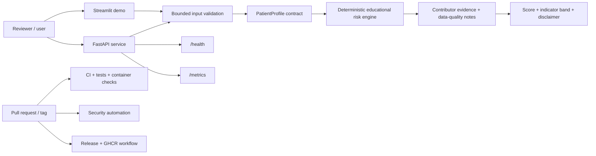
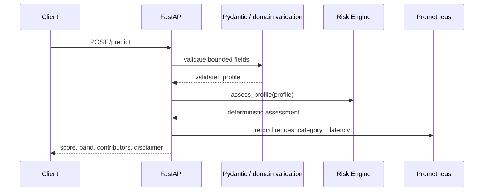

<div align="center">

# 🩺 Disease Prediction Capstone

### Evidence-first educational health-risk screening platform with FastAPI, Streamlit, CI/CD, security automation, and containerized deployment.

[](https://github.com/CoreyLeath-code/Disease_Prediction_Capstone/actions/workflows/ci.yml)
[](https://github.com/CoreyLeath-code/Disease_Prediction_Capstone/actions/workflows/security.yml)
[](https://github.com/CoreyLeath-code/Disease_Prediction_Capstone/releases)
[](https://www.python.org/)
[](https://fastapi.tiangolo.com/)
[](https://streamlit.io/)
[](Dockerfile)
[](LICENSE)

</div>

> **Educational demonstration only.** This repository does not diagnose disease, provide medical advice, estimate a clinically calibrated probability, or claim clinical validation. Any healthcare use would require representative clinical data, pre-registered evaluation, calibration and subgroup analysis, regulatory review where applicable, and human oversight.

## Executive summary

Disease Prediction Capstone is a software-engineering and ML-systems portfolio project centered on a transparent educational risk-screening baseline. The verified public path uses deterministic rules over bounded inputs rather than presenting an unvalidated statistical model as a clinical predictor. The repository demonstrates API design, validation, explainable outputs, Streamlit delivery, non-root containerization, testing, release automation, and security workflows while keeping medical claims deliberately bounded.

The current core engine is deterministic: `src/risk_engine.py` validates nine features, computes a visible rule-based score, returns a low/moderate/elevated indicator band, records the contributing thresholds, and always includes a non-clinical disclaimer. The score is not a disease probability and the heuristic weights are not learned from patient outcomes.

## What is verified

- bounded `PatientProfile` validation with finite-value checks and blood-pressure consistency
- deterministic `assess_profile()` scoring and explainable contributor output
- fictional low/moderate/elevated example profiles
- FastAPI request/response contracts, liveness and metrics surfaces
- Streamlit demonstration path
- Python CI, tests, lint/compile checks, container smoke validation, and security automation
- non-root Python 3.11 runtime container
- semantic-tag release workflow and GHCR container publishing path

## What is not claimed

- clinical diagnosis or treatment recommendation
- AUROC, sensitivity, specificity, precision/recall, or calibrated disease probability for the public baseline
- external or prospective clinical validation
- fairness across demographic or clinical subgroups
- production SLOs, internet-scale load, or regulated deployment readiness
- safety of processing identifiable patient data in the public demo

---

## Architecture flowchart



## System design flow



### Deployment boundary

The production-shaped container is intentionally narrow. The Dockerfile copies only `api/` and `src/`, installs API dependencies into a virtual environment, runs as UID `10001`, exposes port `8000`, defines an HTTP health check, and starts `uvicorn api.main:app`. This verifies container packaging and process health; it does not establish clinical or large-scale operational readiness.

---

## Quick Start

### 1. Clone and install

Prerequisites: Python 3.10 or 3.11, Git, and Docker if you want to validate the container path.

```bash
git clone https://github.com/CoreyLeath-code/Disease_Prediction_Capstone.git
cd Disease_Prediction_Capstone
python -m venv .venv
```

Linux/macOS:

```bash
source .venv/bin/activate
```

Windows PowerShell:

```powershell
.\.venv\Scripts\Activate.ps1
```

Install dependencies:

```bash
python -m pip install --upgrade pip
pip install -r requirements-dev.txt
```

### 2. Run the API

```bash
uvicorn api.main:app --reload --host 0.0.0.0 --port 8000
```

| Route | Purpose |
|---|---|
| `GET /` | service identity and responsible-use metadata |
| `GET /health` | liveness contract |
| `GET /metrics` | Prometheus exposition |
| `GET /examples` | reproducible fictional examples |
| `POST /predict` | validated educational screening result |

Example request:

```bash
curl -X POST http://localhost:8000/predict \
  -H "Content-Type: application/json" \
  -d '{"age":52,"bmi":28.4,"systolic_bp":134,"diastolic_bp":84,"glucose":112,"insulin":118,"skin_thickness":30,"cholesterol":216,"hba1c":5.9}'
```

### 3. Run the Streamlit demo

```bash
streamlit run streamlit_demo/app.py
```

Use fictional or fully non-identifiable values only.

### 4. Validate locally

```bash
python -m compileall -q api agents src tests streamlit_app.py streamlit_demo/app.py
ruff check api agents src tests streamlit_app.py streamlit_demo/app.py --select E9,F63,F7,F82
pytest tests/test_api.py tests/test_risk_engine.py tests/test_supervisor.py -v
docker build -t disease-prediction-capstone:local .
```

---

## Evidence and reproducibility

A result is treated as portfolio evidence only when the exact code path, command, environment, and artifact are identifiable. CI status by itself is not treated as proof of model quality.

| Evidence class | Current repository evidence | What it proves | What it does not prove |
|---|---|---|---|
| Domain correctness | deterministic risk-engine tests | bounded input and deterministic contract behavior | medical validity |
| API correctness | request/response and failure-mode tests | interface behavior | clinical usefulness |
| Explainability | contributor/disclaimer contract | transparent heuristic reasoning | causal explanation |
| Containerization | non-root Docker image + health check | package/startup viability | production capacity |
| Security | CodeQL / dependency / secret / container-oriented automation | automated risk screening | absence of all vulnerabilities |
| Release | semantic-tag release and GHCR workflow | repeatable artifact publication path | runtime SLOs |

### Reproducibility checklist

For every future benchmark or model-quality claim, record:

1. commit SHA and release tag;
2. exact command and configuration;
3. Python and dependency versions;
4. operating system and hardware;
5. dataset/source version and checksum;
6. train/validation/test split procedure;
7. random seed or seed set;
8. warm-up and sample counts for runtime benchmarks;
9. machine-readable output artifact;
10. known limitations and invalid comparisons.

A future learned model should also pin preprocessing logic and serialized model artifacts so inference is tied to the exact training/evaluation pipeline.

---

## Research-style benchmarks and metrics

### Current evidence boundary

The public runtime is a deterministic educational baseline, so the README deliberately does **not** publish clinical accuracy, sensitivity, specificity, AUROC, calibration error, or disease-risk probability. Those metrics would be misleading without a defined dataset, target label, leakage controls, split policy, subgroup analysis, and confidence intervals.

### Engineering benchmark protocol

| Dimension | Required record |
|---|---|
| Source | commit SHA and release tag |
| Environment | OS, CPU/GPU, RAM, Python, container/runtime |
| Workload | endpoint, payload shape, concurrency, fixture seed |
| Procedure | warm-up count, measured count, timeout policy |
| Latency | median, p95, p99 |
| Capacity | requests/second and error rate |
| Resources | peak memory and CPU utilization |
| Scope | whether startup/network/serialization are included |

No benchmark number should be promoted to this README until its machine-readable artifact and environment metadata are committed or attached to a release.

### Required protocol for a future trained classifier

Before claiming predictive improvement, evaluate against a frozen, representative dataset using patient-level leakage controls and a pre-declared split. Report at minimum:

- sample count and prevalence;
- train/validation/test sizes;
- missing-data policy and preprocessing fit boundary;
- AUROC and AUPRC with confidence intervals;
- sensitivity/specificity at declared operating points;
- calibration curve, Brier score, and expected calibration error;
- subgroup results with uncertainty;
- threshold-selection procedure;
- repeated seeds or cross-validation where appropriate;
- comparison against transparent baselines;
- documented failure modes and out-of-distribution limitations.

For this repository, any such future results remain **research metrics**, not evidence of clinical effectiveness.

---

## L6 engineering audit summary

### Strongest aspects

The repository has a disciplined safety boundary for a health-related portfolio project. The core implementation explicitly calls itself an educational screening baseline, validates finite/ranged inputs, keeps heuristic weights inspectable, and returns a mandatory disclaimer. Tests exercise deterministic behavior, serialization, low/moderate/elevated examples, zero-value data-quality notes, invalid ranges, and inconsistent blood pressure.

The delivery layer is also stronger than a typical capstone: FastAPI and Streamlit are separated from the domain engine, the API container runs as a non-root user, and GitHub Actions already includes CI, security, dependency-review, retraining, and release workflows.

### Highest-priority gaps

**1. The repository name implies disease prediction more strongly than the verified implementation.** The public path is not a trained disease predictor; it is a deterministic educational risk indicator. README language must preserve that distinction everywhere.

**2. No clinical-model evidence exists for the current public path.** Publishing accuracy/AUROC-style claims without a frozen dataset and evaluation contract would be inappropriate.

**3. Benchmark evidence is process-oriented rather than measured performance evidence.** The repository needs a dedicated JSON-producing latency/load harness before numeric runtime claims are added.

**4. Release packaging is stronger than release verification.** A tag can publish source/container artifacts, but a future hardening pass should attach checksums, immutable image digests, release evidence, and verify that release workflows build the exact tagged commit.

**5. Model-development and demo-runtime stories should remain separated.** The deterministic demo is appropriate for public deployment; any retraining path should not silently replace it without versioned artifacts and explicit evaluation gates.

See [`L6_AUDIT.md`](L6_AUDIT.md) for the full promotion checklist.

---

## Extended Q&A

**Is this application a medical diagnostic tool?**  
No. It is an educational software-engineering demonstration and is not intended for diagnosis, treatment, or medical decision-making.

**Is the score a probability that a person has a disease?**  
No. The score is a deterministic heuristic produced by visible rules. It is not calibrated against outcomes and must not be interpreted as a probability.

**Why use a deterministic baseline instead of shipping an old model artifact?**  
Because a transparent, reproducible baseline is more defensible than exposing an unvalidated model while implying medical performance that the repository cannot substantiate.

**What makes the implementation reproducible?**  
The public engine has no stochastic model inference, its examples are fictional and fixed, the validation/scoring code is checked in, tests assert deterministic output, and the container path uses an explicit Python runtime and dependency set.

**What evidence would be required before adding a learned model?**  
A versioned dataset or data manifest, leakage-safe split protocol, pinned preprocessing pipeline, reproducible training configuration, model artifact hash, held-out evaluation, calibration analysis, subgroup analysis, multiple seeds or equivalent uncertainty analysis, and a model card.

**Does a passing CI badge mean the model is medically safe?**  
No. CI validates software contracts and automation. It does not establish clinical validity, fairness, calibration, safety, or regulatory compliance.

**What does the Docker image prove?**  
It proves that the API can be packaged and started in a non-root container with an explicit health check. It does not prove capacity, resilience, SLO compliance, or healthcare deployment readiness.

**Why retain the `Disease_Prediction_Capstone` name?**  
It preserves the original capstone identity. The README and runtime descriptions deliberately narrow the current verified capability to educational risk screening.

---

## Engineering roadmap

### Phase 1 — Evidence baseline

- keep the deterministic public demo as the default verified runtime
- consolidate claims around code-backed behavior
- produce machine-readable runtime benchmark artifacts
- record commit SHA, environment, warm-up, sample count, and percentiles
- tighten release evidence with archive checksum and image digest capture

### Phase 2 — Research-grade learned baseline

- introduce a clearly versioned training dataset or data manifest
- implement leakage-safe preprocessing and split boundaries
- compare logistic regression / tree-based / neural baselines under one frozen evaluation protocol
- report uncertainty and calibration rather than a single accuracy number
- add a model card and data-provenance documentation

### Phase 3 — Reliability and observability

- add structured request/error logging without sensitive payload capture
- add repeatable API load tests and regression thresholds
- capture p50/p95/p99, throughput, error rate, memory, and CPU utilization
- validate restart/readiness behavior and rollback procedures

### Phase 4 — Supply-chain hardening

- emit source SHA-256 checksums and CycloneDX/SPDX release artifacts
- scan final container images in release workflows
- pin critical GitHub Actions to immutable commits where practical
- sign or attest release images and document verification

### Phase 5 — Higher-assurance health ML research

- evaluate representative external datasets only under documented governance
- run subgroup/fairness and calibration analyses
- add drift and data-quality monitoring contracts
- perform independent review of intended use and failure modes
- keep clinical deployment explicitly out of scope until appropriate validation and governance exist

---

## Release and package path

Tags matching `v*.*.*` publish GitHub Release artifacts and build/push the GHCR container image under:

```text
ghcr.io/coreyleath-code/disease-prediction-capstone
```

Release/package presence is evidence of artifact publication, not model-quality evidence.

## Responsible use

Use only fictional, synthetic, or fully non-identifiable inputs in the public demo. Do not enter private patient data, protected health information, or information that could be used for real medical decisions.

## Author

Corey Leath

Software / AI engineering portfolio project focused on transparent ML systems, reproducibility, MLOps, API engineering, and evidence-backed documentation.
